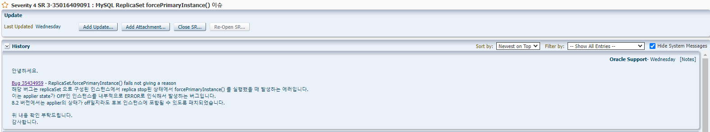

# MHA <> ReplicaSet 호환 변경사항
<hr>

## masterha_check_repl 실행 시 오류 발생

#### REHL 8버전 부터 master_check_repl 실행 시 오류 발생

```bash
[root@RPE1101200002 ~]# masterha_check_repl --conf=/etc/mha.cnf
Fri Dec  1 09:46:21 2023 - [warning] Global configuration file /etc/masterha_default.cnf not found. Skipping.
Fri Dec  1 09:46:21 2023 - [info] Reading application default configuration from /etc/mha.cnf..
Fri Dec  1 09:46:21 2023 - [info] Reading server configuration from /etc/mha.cnf..
Fri Dec  1 09:46:21 2023 - [info] MHA::MasterMonitor version 0.58.
Fri Dec  1 09:46:21 2023 - [debug] Connecting to servers..
Fri Dec  1 09:46:22 2023 - [debug]  Connected to: 100.100.100.2(100.100.100.2:3306), user=rsadmin
Fri Dec  1 09:46:22 2023 - [debug]  Number of slave worker threads on host 100.100.100.2(100.100.100.2:3306): 4
Fri Dec  1 09:46:22 2023 - [debug]  Connected to: 100.100.100.3(100.100.100.3:3306), user=rsadmin
Fri Dec  1 09:46:22 2023 - [debug]  Number of slave worker threads on host 100.100.100.3(100.100.100.3:3306): 4
Fri Dec  1 09:46:22 2023 - [error][/usr/share/perl5/vendor_perl/MHA/MasterMonitor.pm, ln427] Error happened on checking configurations. Redundant argument in sprintf at /usr/share/perl5/vendor_perl/MHA/NodeUtil.pm line 195.
Fri Dec  1 09:46:22 2023 - [error][/usr/share/perl5/vendor_perl/MHA/MasterMonitor.pm, ln525] Error happened on monitoring servers.
Fri Dec  1 09:46:22 2023 - [info] Got exit code 1 (Not master dead).

MySQL Replication Health is NOT OK!

```

#### 변경사항 

##### /usr/share/perl5/vendor_perl/MHA/NodeUtil.pm

변경 전
```bash
...
193 sub parse_mysql_version($) {
194    my $str = shift;
195  $str =~ /(\d+)\.(\d+)/;
196  my $strmajor = "$1.$2";
197  my $result = sprintf( '%03d%03d', $strmajor =~ m/(\d+)/g );
198  return $result;
199
200 }
201
202 sub parse_mysql_major_version($) {
203    my $str = shift;
204  $str =~ /(\d+)\.(\d+)/;
205  my $strmajor = "$1.$2";
206  my $result = sprintf( '%03d%03d', $strmajor =~ m/(\d+)/g );
207  return $result;
208 }

...
```

변경 후
```bash
...
    193 sub parse_mysql_version($) {
    194   my $str = shift;
    195   $str =~ /(\d+)\.(\d+)/;
    196   my $strmajor = "$1.$2";
    197   my $result = sprintf( '%03d%03d', $strmajor =~ m/(\d+)/g );
    198   return $result;
    199 }
    200
    201 sub parse_mysql_major_version($) {
    202   my $str = shift;
    203   $str =~ /(\d+)\.(\d+)/;
    204   my $strmajor = "$1.$2";
    205   my $result = sprintf( '%03d%03d', $strmajor =~ m/(\d+)/g );
    206   return $result;
    207 }


...
```

<hr>

## '!'가 들어간 DB 계정 접근 불가 현상

#### NodeUtil.pm의 특수문자 escape 처리에서 해당 문제 발생
- 명령줄에서는 비밀번호에 대해 escape 처리가 필요하지만, DB Connector 유틸(DBI)에서는 불필요
- 코드 수정 없이 특수문자 '@' 넣어 해당 현상 회피

<hr>

## Failover 시 mysqlsh dba.forcePrimaryInstance() 불가

#### MHA Manager에서 Failover 시 기존 Secondary에서 STOP REPLICA; 커맨드 입력하여 해당 오류 발생


/mha/log/mha.log
```bash
You are connected to a member of replicaset 'replicaSet'.
* Connecting to replicaset instances
** Connecting to 100.100.100.3:3306

ERROR: Replication applier is OFF at instance 100.100.100.3:3306.
ERROR: Replication errors found for one or more SECONDARY instances. Use the 'invalidateErrorInstances' option to perform the failover anyway by skipping and invalidating instances with errors.
ReplicaSet.forcePrimaryInstance: One or more instances have replication applier errors. (MYSQLSH 51145)
 at (command line):1:27
in [x=dba.getReplicaSet(), x.forcePrimaryInstance('100.100.100.3:3306')]

```


## 소스 수정

<b>MasterFailover.pm</b>

변경 전
```perl
...
   1464 sub recover_master_gtid_internal($$$) {
   1465   my $target            = shift;
   1466   my $latest_slave      = shift;
   1467   my $binlog_server_ref = shift;
   1468   my $relay_master_log_file;
   1469   my $exec_master_log_pos;
   1470   $log->info();
   1471   $log->info("* Phase 3.3: New Master Recovery Phase..\n");
   1472   $log->info();
   1473   $log->info(" Waiting all logs to be applied.. ");
   1474   my $ret = $target->wait_until_relay_log_applied($log);
   1475
   1476   if ($ret) {
   1477     $log->error(" Failed with return code $ret");
   1478     return -1;
   1479   }
   1480   $log->info("  done.");
   1481   $target->stop_slave($log);

...
```

변경 후
```perl
...
   1464 sub recover_master_gtid_internal($$$) {
   1465   my $target            = shift;
   1466   my $latest_slave      = shift;
   1467   my $binlog_server_ref = shift;
   1468   my $relay_master_log_file;
   1469   my $exec_master_log_pos;
   1470   $log->info();
   1471   $log->info("* Phase 3.3: New Master Recovery Phase..\n");
   1472   $log->info();
   1473   $log->info(" Waiting all logs to be applied.. ");
   1474   my $ret = $target->wait_until_relay_log_applied($log);
   1475
   1476   if ($ret) {
   1477     $log->error(" Failed with return code $ret");
   1478     return -1;
   1479   }
   1480   $log->info("  done.");
   1481   #$target->stop_slave($log); 

...
```

<b>Server.pm</b>

변경 전
```perl
...
    691 # Let the server to return nothing at SHOW SLAVE STATUS (Without this, the new master still points to the previous master)
    692 sub reset_slave_info($) {
    693   my $self     = shift;
    694   my $log      = $self->{logger};
    695   my $dbhelper = $self->{dbhelper};
    696   $log->debug(" Clearing slave info..");
    697   if ( $self->stop_slave() ) {
    698     $log->error(" Stopping slave failed!");
    699     return 1;
    700   }
    701   $self->reset_slave_all();
    702   my %status = $dbhelper->check_slave_status();
    703   if ( $status{Status} == 1 ) {
    704     $log->debug(
    705 " SHOW SLAVE STATUS shows new master does not replicate from anywhere. OK."
    706     );
...
```

변경 후
```perl
...
    691 # Let the server to return nothing at SHOW SLAVE STATUS (Without this, the new master still points to the previous master)
    692 sub reset_slave_info($) {
    693   my $self     = shift;
    694   my $log      = $self->{logger};
    695   my $dbhelper = $self->{dbhelper};
    696   $log->debug(" Clearing slave info..");
    697   #if ( $self->stop_slave() ) {
    698   #  $log->error(" Stopping slave failed!");
    699   #  return 1;
    700   #}
    701   #$self->reset_slave_all();
    702   my %status = $dbhelper->check_slave_status();
    703   if ( $status{Status} == 1 ) {
    704     $log->debug(
    705 " SHOW SLAVE STATUS shows new master does not replicate from anywhere. OK."
    706     );
...
```

<hr>

## Roll-Over 시 정상적인 결과 확인 불가

#### dba.setPrimaryInstance() 선 수행으로 MHA Online Change 중 검증 문제 발생


```bash
[root@RPE1101200002 ~]# masterha_master_switch --conf=/etc/mha.cnf --master_state=alive --orig_master_is_new_slave --interactive=0

...

Fri Dec  1 14:55:54 2023 - [info]  ok.
Fri Dec  1 14:55:54 2023 - [info] Locking all tables on the orig master to reject updates from everybody (including root):
Fri Dec  1 14:55:54 2023 - [info] Executing FLUSH TABLES WITH READ LOCK..
Fri Dec  1 14:55:54 2023 - [info]  ok.
Fri Dec  1 14:55:54 2023 - [info] Orig master binlog:pos is mysql-bin.000004:237.
Fri Dec  1 14:55:54 2023 - [debug] Fetching current slave status..
Fri Dec  1 14:55:54 2023 - [error][/usr/share/perl5/vendor_perl/MHA/ServerManager.pm, ln937] Checking slave status failed.
Fri Dec  1 14:55:54 2023 - [error][/usr/share/perl5/vendor_perl/MHA/ManagerUtil.pm, ln178] Got ERROR:  at /usr/share/perl5/vendor_perl/MHA/MasterRotate.pm line 637.
Fri Dec  1 14:55:54 2023 - [debug]  Disconnected from 100.100.100.2(100.100.100.2:3306)
Fri Dec  1 14:55:54 2023 - [debug]  Disconnected from 100.100.100.3(100.100.100.3:3306)

...

```

## 소스 수정

<b>MasterRotate.pm</b>

변경 전

```perl
...

    618 sub do_master_online_switch {
    619   my $error_code = 1;
    620   my $orig_master;
    621
    622   eval {
    623     $orig_master = identify_orig_master();
    624     my $new_master = identify_new_master($orig_master);
    625     $log->info("** Phase 1: Configuration Check Phase completed.\n");
    626     $log->info();
    627
    628     if ($g_check_only) {
    629       $log->info("--check_only is set. Exit.");
    630       $error_code = 0;
    631       return;
    632     }
    633
    634     my ( $orig_master_log_file, $orig_master_log_pos ) =
    635       reject_update( $orig_master, $new_master );
    636
    637     $_server_manager->read_slave_status();
    638
    639     my ( $master_log_file, $master_log_pos ) =
    640       switch_master( $orig_master, $new_master, $orig_master_log_file,
    641       $orig_master_log_pos );
    642
    643     $error_code =
    644       switch_slaves( $orig_master, $new_master, $orig_master_log_file,
    645       $orig_master_log_pos, $master_log_file, $master_log_pos );
    646
    647     if ( $g_remove_orig_master_conf
    648       && !$g_orig_master_is_new_slave
    649       && $error_code == 0 )
    650     {
    651       MHA::Config::delete_block_and_save( $g_config_file, $orig_master->{id},
    652         $log );
    653     }
    654
    655     $_server_manager->release_failover_advisory_lock();
    656     $_server_manager->disconnect_all();
    657   };
    658   if ($@) {
    659    if ( $orig_master && $orig_master->{not_error} ) {
    660       $log->info($@);
    661     }
    662     else {
    663       MHA::ManagerUtil::print_error( "Got ERROR: $@", $log );
    664     }
    665     $_server_manager->disconnect_all() if ($_server_manager);
    666     undef $@;
    667   }
    668
    669   return $error_code;
    670 }
...

```

변경 후
```perl
...

    618 sub do_master_online_switch {
    619   my $error_code = 1;
    620   my $orig_master;
    621
    622   #eval {
    623     $orig_master = identify_orig_master();
    624     my $new_master = identify_new_master($orig_master);
    625     $log->info("** Phase 1: Configuration Check Phase completed.\n");
    626     $log->info();
    627
    628     if ($g_check_only) {
    629       $log->info("--check_only is set. Exit.");
    630       $error_code = 0;
    631       return;
    632     }
    633
    634     my ( $orig_master_log_file, $orig_master_log_pos ) =
    635       reject_update( $orig_master, $new_master );
    636
    637     #$_server_manager->read_slave_status();
    638
    639     #my ( $master_log_file, $master_log_pos ) =
    640       switch_master( $orig_master, $new_master, $orig_master_log_file,
    641       $orig_master_log_pos );
    642
    643     #$error_code =
    644     #  switch_slaves( $orig_master, $new_master, $orig_master_log_file,
    645     #  $orig_master_log_pos, $master_log_file, $master_log_pos );
    646
    647     #if ( $g_remove_orig_master_conf
    648     #  && !$g_orig_master_is_new_slave
    649     #  && $error_code == 0 )
    650     #{
    651     #  MHA::Config::delete_block_and_save( $g_config_file, $orig_master->{id},
    652     #    $log );
    653     #}
    654
    655     #$_server_manager->release_failover_advisory_lock();
    656     #$_server_manager->disconnect_all();
    657   #};
    658   #if ($@) {
    659    #if ( $orig_master && $orig_master->{not_error} ) {
    660       #$log->info($@);
    661     #}
    662     #else {
    663       #MHA::ManagerUtil::print_error( "Got ERROR: $@", $log );
    664     #}
    665     #$_server_manager->disconnect_all() if ($_server_manager);
    666     #undef $@;
    667   #}
    668
    669   return $error_code;
    670 }
...

```

<b>MasterRotate.pm</b>

변경 전

```perl
    277 sub reject_update($$) {
    278   my $orig_master = shift;
    279   my $new_master  = shift;
    280   my $ret;
    281   $orig_master->release_monitor_advisory_lock();
    282   $orig_master->disconnect();
    283
    284   $log->info("* Phase 2: Rejecting updates Phase..\n");
    285   $log->info();
    286   if ( $new_master->{master_ip_online_change_script} ) {
    287     my $command =
    288 "$orig_master->{master_ip_online_change_script} --command=stop --orig_master_host=$orig_master->{hostname} --orig_master_ip=$o        rig_master->{ip} --orig_master_port=$orig_master->{port} --orig_master_user=$orig_master->{escaped_user} --new_master_host=$ne        w_master->{hostname} --new_master_ip=$new_master->{ip} --new_master_port=$new_master->{port} --new_master_user=$new_master->{e        scaped_user}";
    289     $command .= " --orig_master_ssh_user=$orig_master->{ssh_user}";
    290     $command .= " --new_master_ssh_user=$new_master->{ssh_user}";
    291     $command .= $orig_master->get_ssh_args_if( 1, "orig", 1 );
    292     $command .= $new_master->get_ssh_args_if( 2, "new", 1 );
    293     if ($g_orig_master_is_new_slave) {
    294       $command .= " --orig_master_is_new_slave";
    295     }
    296     $log->info(
    297 "Executing master ip online change script to disable write on the current master:"
    298     );
    299     $log->info(
    300       "  $command --orig_master_password=xxx --new_master_password=xxx");
    301     $command .=
    302 " --orig_master_password=$orig_master->{escaped_password} --new_master_password=$new_master->{escaped_password}";
    303     my ( $high, $low ) = MHA::ManagerUtil::exec_system($command);
    304
    305     if ( $high == 0 && $low == 0 ) {
    306       $log->info(" ok.");
    307     }
    308     else {
    309       if ( $high == 10 ) {
    310         $log->warning("Proceeding.");
    311       }
    312       else {
    313         croak;
    314       }
    315     }
    316   }
    317   elsif ($g_interactive) {
    318     print
    319 "master_ip_online_change_script is not defined. If you do not disable writes on the current master manually, applications keep         writing on the current master. Is it ok to proceed? (yes/NO): ";
    320     $ret = <STDIN>;
    321     chomp($ret);
    322     if ( lc($ret) !~ /^y/ ) {
    323       $orig_master->{not_error} = 1;
    324       die "Not typed yes. Stopping.";
    325     }
    326   }
    327   else {
    328     $log->warning(
    329 "master_ip_online_change_script is not defined. Skipping disabling writes on the current master."
    330     );
    331   }
    332
    333   # It is necessary to keep connecting on the orig master to check
    334   # binary log is not proceeding. master write control script may kill
    335   # previous connections, so it is needed to establish connection again.
    336   unless ( $orig_master->reconnect() ) {
    337     $log->error(
    338       sprintf( "Failed to connect to the orig master %s!",
    339         $orig_master->get_hostinfo() )
    340     );
    341     croak;
    342   }
    343
    344   my ( $orig_master_log_file, $orig_master_log_pos );
    345   if ($g_skip_lock_all_tables) {
    346     $log->info("Skipping locking all tables.");
    347   }
    348   else {
    349     $log->info(
    350 #"Locking all tables on the orig master to reject updates from everybody (including root):"
    351     );
    352   }
    353   if ( $g_skip_lock_all_tables || $orig_master->lock_all_tables() ) {
    354
    355     # FLUSH TABLES WITH READ LOCK is skipped or failed.
    356     # So we need to verify binlog writes are stopped or not.
    357     # All slaves should complete replication until this position
    358     ( $orig_master_log_file, $orig_master_log_pos ) =
    359       $orig_master->check_binlog_stop();
    360   }
    361   else {
    362     ( $orig_master_log_file, $orig_master_log_pos ) =
    363       $orig_master->get_binlog_position();
    364   }
    365   if ( !$orig_master_log_file || !defined($orig_master_log_pos) ) {
    366     $log->error("Failed to get orig master's binlog and/or position!");
    367     croak;
    368   }
    369   $log->info(
    370     sprintf(
    371       "Orig master binlog:pos is %s:%d.",
    372       $orig_master_log_file, $orig_master_log_pos
    373     )
    374   );
    375   return ( $orig_master_log_file, $orig_master_log_pos );
    376 }
    377
    378 sub switch_master_internal($$$) {
    379   my $target               = shift;
    380   my $orig_master_log_file = shift;
    381   my $orig_master_log_pos  = shift;
    382   if ( $target->master_pos_wait( $orig_master_log_file, $orig_master_log_pos ) )
    383   {
    384     return;
    385   }
    386   return $_server_manager->get_new_master_binlog_position($target);
    387 }

```
변경 후

```perl
    277 sub reject_update($$) {
    278   my $orig_master = shift;
    279   my $new_master  = shift;
    280   my $ret;
    281   $orig_master->release_monitor_advisory_lock();
    282   $orig_master->disconnect();
    283
    284   $log->info("* Phase 2: Rejecting updates Phase..\n");
    285   $log->info();
    286   if ( $new_master->{master_ip_online_change_script} ) {
    287     my $command =
    288 "$orig_master->{master_ip_online_change_script} --command=stop --orig_master_host=$orig_master->{hostname} --orig_master_ip=$o        rig_master->{ip} --orig_master_port=$orig_master->{port} --orig_master_user=$orig_master->{escaped_user} --new_master_host=$ne        w_master->{hostname} --new_master_ip=$new_master->{ip} --new_master_port=$new_master->{port} --new_master_user=$new_master->{e        scaped_user}";
    289     $command .= " --orig_master_ssh_user=$orig_master->{ssh_user}";
    290     $command .= " --new_master_ssh_user=$new_master->{ssh_user}";
    291     $command .= $orig_master->get_ssh_args_if( 1, "orig", 1 );
    292     $command .= $new_master->get_ssh_args_if( 2, "new", 1 );
    293     if ($g_orig_master_is_new_slave) {
    294       $command .= " --orig_master_is_new_slave";
    295     }
    296     $log->info(
    297 "Executing master ip online change script to disable write on the current master:"
    298     );
    299     $log->info(
    300       "  $command --orig_master_password=xxx --new_master_password=xxx");
    301     $command .=
    302 " --orig_master_password=$orig_master->{escaped_password} --new_master_password=$new_master->{escaped_password}";
    303     my ( $high, $low ) = MHA::ManagerUtil::exec_system($command);
    304
    305     if ( $high == 0 && $low == 0 ) {
    306       $log->info(" ok.");
    307     }
    308     else {
    309       if ( $high == 10 ) {
    310         $log->warning("Proceeding.");
    311       }
    312       else {
    313         croak;
    314       }
    315     }
    316   }
    317   elsif ($g_interactive) {
    318     print
    319 "master_ip_online_change_script is not defined. If you do not disable writes on the current master manually, applications keep         writing on the current master. Is it ok to proceed? (yes/NO): ";
    320     $ret = <STDIN>;
    321     chomp($ret);
    322     if ( lc($ret) !~ /^y/ ) {
    323       $orig_master->{not_error} = 1;
    324       die "Not typed yes. Stopping.";
    325     }
    326   }
    327   else {
    328     $log->warning(
    329 "master_ip_online_change_script is not defined. Skipping disabling writes on the current master."
    330     );
    331   }
    332
    333   # It is necessary to keep connecting on the orig master to check
    334   # binary log is not proceeding. master write control script may kill
    335   # previous connections, so it is needed to establish connection again.
    336   unless ( $orig_master->reconnect() ) {
    337     $log->error(
    338       sprintf( "Failed to connect to the orig master %s!",
    339         $orig_master->get_hostinfo() )
    340     );
    341     croak;
    342   }
    343
    344   my ( $orig_master_log_file, $orig_master_log_pos );
    345   #if ($g_skip_lock_all_tables) {
    346   #  $log->info("Skipping locking all tables.");
    347   #}
    348   #else {
    349   #  $log->info(
    350 #"Locking all tables on the orig master to reject updates from everybody (including root):"
    351   #  );
    352   #}
    353   #if ( $g_skip_lock_all_tables || $orig_master->lock_all_tables() ) {
    354
    355     # FLUSH TABLES WITH READ LOCK is skipped or failed.
    356     # So we need to verify binlog writes are stopped or not.
    357     # All slaves should complete replication until this position
    358     ( $orig_master_log_file, $orig_master_log_pos ) =
    359       $orig_master->check_binlog_stop();
    360   #}
    361   #else {
    362   #  ( $orig_master_log_file, $orig_master_log_pos ) =
    363   #    $orig_master->get_binlog_position();
    364   #}
    365   #if ( !$orig_master_log_file || !defined($orig_master_log_pos) ) {
    366   #  $log->error("Failed to get orig master's binlog and/or position!");
    367   #  croak;
    368   #}
    369   #$log->info(
    370   #  sprintf(
    371   #    "Orig master binlog:pos is %s:%d.",
    372   #    $orig_master_log_file, $orig_master_log_pos
    373   #  )
    374   #);
    375   return ( $orig_master_log_file, $orig_master_log_pos );
    376 }
    377
    378 sub switch_master_internal($$$) {
    379   my $target               = shift;
    380   my $orig_master_log_file = shift;
    381   my $orig_master_log_pos  = shift;
    382   if ( $target->master_pos_wait( $orig_master_log_file, $orig_master_log_pos ) )
    383   {
    384     return;
    385   }
    386   return $_server_manager->get_new_master_binlog_position($target);
    387 }

```

<b>MasterRotate.pm</b>

변경 전

```perl
sub switch_master($$$$) {
  my $orig_master          = shift;
  my $new_master           = shift;
  my $orig_master_log_file = shift;
  my $orig_master_log_pos  = shift;

  my ( $master_log_file, $master_log_pos ) =
    switch_master_internal( $new_master, $orig_master_log_file,
    $orig_master_log_pos );
  if ( !$master_log_file or !defined($master_log_pos) ) {
    $log->error("Failed to get new master's binlog and/or position!");
    croak;
  }

  # Allow write access on the new master
  if ( $new_master->{master_ip_online_change_script} ) {
    my $command =
"$new_master->{master_ip_online_change_script} --command=start --orig_master_host=$orig_master->{hostname} --orig_master_ip=$orig_master->{ip} --orig_master_port=$orig_master->{port} --orig_master_user=$orig_master->{escaped_user} --new_master_host=$new_master->{hostname} --new_master_ip=$new_master->{ip} --new_master_port=$new_master->{port} --new_master_user=$new_master->{escaped_user}";
    $command .= " --orig_master_ssh_user=$orig_master->{ssh_user}";
    $command .= " --new_master_ssh_user=$new_master->{ssh_user}";
    $command .= $orig_master->get_ssh_args_if( 1, "orig", 1 );
    $command .= $new_master->get_ssh_args_if( 2, "new", 1 );
    if ($g_orig_master_is_new_slave) {
      $command .= " --orig_master_is_new_slave";
    }
    $log->info(
"Executing master ip online change script to allow write on the new master:"
    );
    $log->info(
      "  $command --orig_master_password=xxx --new_master_password=xxx");
    $command .=
" --orig_master_password=$orig_master->{escaped_password} --new_master_password=$new_master->{escaped_password}";
    my ( $high, $low ) = MHA::ManagerUtil::exec_system($command);

    if ( $high == 0 && $low == 0 ) {
      $log->info(" ok.");
    }
    else {
      if ( $high == 10 ) {
        $log->warning("Proceeding.");
      }
      else {
        croak;
      }
    }
  }

  # Allow write access on master (if read_only==1)
  $new_master->disable_read_only();

  return ( $master_log_file, $master_log_pos );
}

```

변경 후

```perl
sub switch_master($$$$) {
  my $orig_master          = shift;
  my $new_master           = shift;
  my $orig_master_log_file = shift;
  my $orig_master_log_pos  = shift;

  my ( $master_log_file, $master_log_pos ) =
    switch_master_internal( $new_master, $orig_master_log_file,
    $orig_master_log_pos );
 # if ( !$master_log_file or !defined($master_log_pos) ) {
 #   $log->error("Failed to get new master's binlog and/or position!");
 #   croak;
 # }

  # Allow write access on the new master
  if ( $new_master->{master_ip_online_change_script} ) {
    my $command =
"$new_master->{master_ip_online_change_script} --command=start --orig_master_host=$orig_master->{hostname} --orig_master_ip=$orig_master->{ip} --orig_master_port=$orig_master->{port} --orig_master_user=$orig_master->{escaped_user} --new_master_host=$new_master->{hostname} --new_master_ip=$new_master->{ip} --new_master_port=$new_master->{port} --new_master_user=$new_master->{escaped_user}";
    $command .= " --orig_master_ssh_user=$orig_master->{ssh_user}";
    $command .= " --new_master_ssh_user=$new_master->{ssh_user}";
    $command .= $orig_master->get_ssh_args_if( 1, "orig", 1 );
    $command .= $new_master->get_ssh_args_if( 2, "new", 1 );
    if ($g_orig_master_is_new_slave) {
      $command .= " --orig_master_is_new_slave";
    }
    $log->info(
"Executing master ip online change script to allow write on the new master:"
    );
    $log->info(
      "  $command --orig_master_password=xxx --new_master_password=xxx");
    $command .=
" --orig_master_password=$orig_master->{escaped_password} --new_master_password=$new_master->{escaped_password}";
    my ( $high, $low ) = MHA::ManagerUtil::exec_system($command);

    if ( $high == 0 && $low == 0 ) {
      $log->info(" ok.");
    }
    else {
      if ( $high == 10 ) {
        $log->warning("Proceeding.");
      }
      else {
        croak;
      }
    }
  }

  # Allow write access on master (if read_only==1)
  $new_master->disable_read_only();

  return ( $master_log_file, $master_log_pos );
}

```

<b>Server.pm</b>

변경 전

```perl
   1002 sub master_pos_wait_internal {
   1003   my ( $self, $binlog_file, $binlog_pos, $log ) = @_;
   1004    $log = $self->{logger} unless ($log);
   1005    my $dbhelper = $self->{dbhelper};
   1006    my $res = $dbhelper->master_pos_wait( $binlog_file, $binlog_pos );
   1007    if ( !defined($res) ) {
   1008      $log->error(
   1009        sprintf(
   1010  "master_pos_wait(%s:%d) returned NULL on %s. Maybe SQL thread was aborted?",
   1011          $binlog_file, $binlog_pos, $self->get_hostinfo()
   1012        )
   1013      );
   1014     return 1;
   1015    }
   1016    if ( $res >= 0 ) {
   1017      $log->info(
   1018        sprintf(
   1019          " master_pos_wait(%s:%d) completed on %s. Executed %d events.",
   1020          $binlog_file, $binlog_pos, $self->get_hostinfo(), $res
   1021        )
   1022      );
   1023      return 0;
   1024    }
   1025    else {
   1026      $log->error(
   1027        sprintf(
   1028          "master_pos_wait(%s:%d) got error on %s: $res",
   1029          $binlog_file, $binlog_pos, $self->get_hostinfo()
   1030        )
   1031      );
   1032      return 1;
   1033    }
   1034 }
   1035 # We do not reset slave here

```

변경 후 (빈 메서드)

```perl
   1002 sub master_pos_wait_internal {
   1003 my ( $self, $binlog_file, $binlog_pos, $log ) = @_;
   1003 # We do not reset slave here
   1004 }

```
